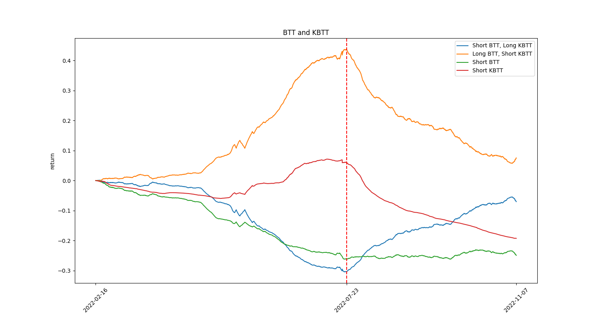
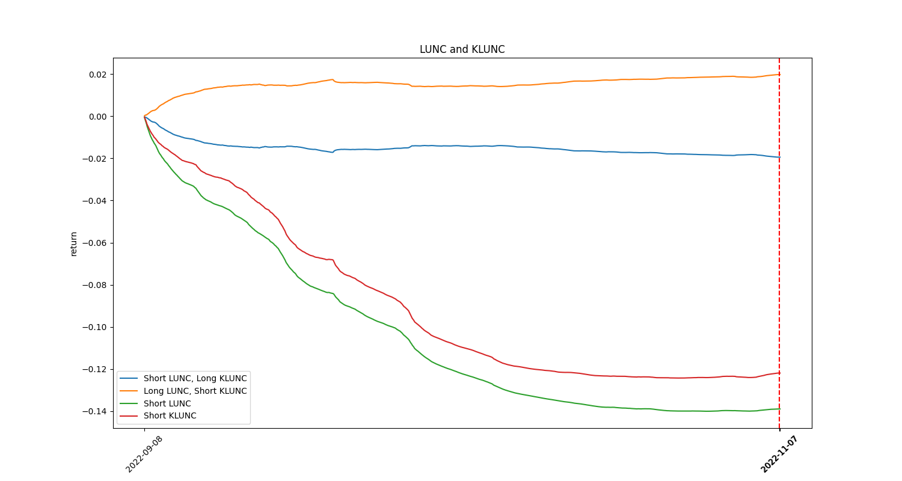

# Pair Funding Rate
Some coins have two different futures on FTX. Price of these futures are close but there is always a gap between their funding rates. This project uses **Long-Short Strategy** to build a market neutral strategy and backtests the return. 


|   Coin   |   K-Coin   |
| -------- | --------   |
|   BTT    |   KBTT     |
|   SHIB   |   KSHIB    |
|   SOS    |   KSOS     |
|   LUNC   |   KLUNC    |


## Install required packages
Test on python 3.9.12
```
pip install -r requirements.txt
```

## Usage
### Download data
Download funding rate history of (K)BTT, (K)SHIB, (K)SOS, (K)LUNC.
```
cd data
bash download_data.sh
```

### Back Test
This script automatically backtests long-short strategy on `Coin` and `KCoin`.
```
python main.py <COIN>
```

### Result
The returns over time are (updated 08:00:00 UTC+8 everyday):





