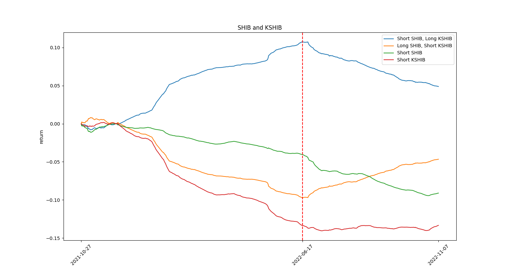
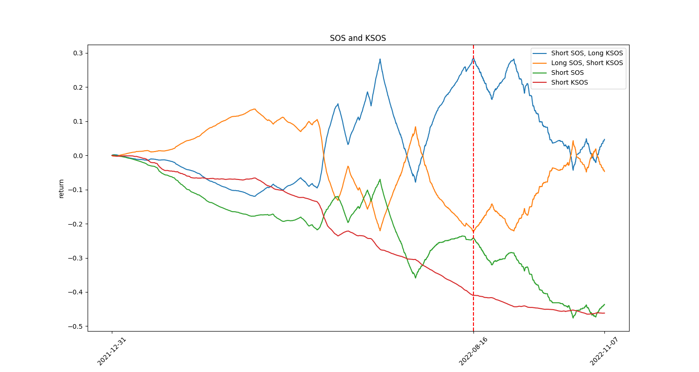

# Pair Funding Rate
Some coins have two different markets on FTX. Price of these markets are close but there is always a gap between their funding rates. This project uses **Long-Short Strategy** to build a market neutral strategy and backtests the return. 


|   Coin   |   K-Coin   |
| -------- | --------   |
|   BTT    |   KBTT     |
|   SHIB   |   KSHIB    |
|   SOS    |   KSOS     |
|   LUNC   |   KLUNC    |


## Install required packages
Test on python 3.9.12
```
pip install -r requirements.txt
```

## Usage
### Download data
Download funding rate history of BTT, KBTT, SHIB, KSHIB, SOS, and KSOS.
```
cd data
bash download_data.sh
```

### Back Test
This script automatically backtests long-short strategy on `Coin` and `K-Coin`.
```
python main.py <COIN>
```

### Result
As of 2022/08/30, the returns over time are:




